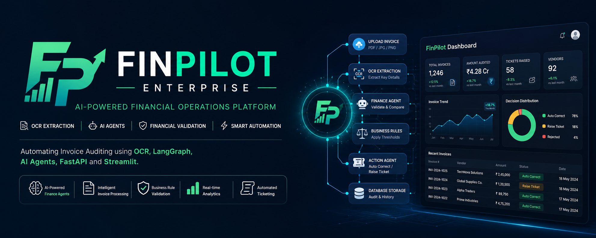

<p align="center">
  
</p>

<h1 align="center">💰 FinPilot Enterprise</h1>

<p align="center">
AI-Powered Financial Operations Platform
</p>

<p align="center">
Automating Invoice Auditing using AI Agents, OCR, LangGraph, FastAPI and Streamlit
</p>

<p align="center">

<a href="https://github.com/manasaavarmaa/FinPilot-Enterprise">

</a>


</p>

---

## 🌟 Overview

FinPilot Enterprise is a production-inspired AI Financial Operations Platform designed to automate the invoice auditing lifecycle.

Instead of manually reviewing invoices, verifying purchase order values, identifying financial discrepancies, generating audit records, and creating support tickets, the platform performs the complete workflow through an intelligent AI pipeline.

The application combines document understanding, workflow orchestration, financial validation, business rules, persistent storage, and interactive analytics into a single modular system.

The primary objective is to demonstrate how AI Agents can automate real-world financial operations while maintaining transparency, traceability, and auditability.

---

## ✨ Key Features

| Feature | Description |
|----------|-------------|
| 🤖 AI Invoice Auditing | Automatically validates invoices using AI and business rules |
| 📄 OCR Extraction | Reads invoice information from PDFs and images |
| 🧠 LangGraph Workflow | Multi-step workflow orchestration using AI agents |
| 💰 Finance Agent | Validates invoice totals against expected values |
| 🎫 Ticket Generation | Automatically raises tickets for invoice mismatches |
| 🗄️ SQLite Storage | Stores invoices, tickets, vendors and audit logs |
| 📊 Analytics Dashboard | Interactive charts, KPIs and operational insights |
| ⚡ FastAPI Backend | REST APIs for frontend and workflow communication |
| 📈 Real-Time KPIs | Dynamic metrics calculated directly from the database |

---
# 📚 Table of Contents

- [Overview](#-overview)
- [Business Problem](#-business-problem)
- [Why FinPilot?](#-why-finpilot)
- [Key Features](#-key-features)
- [System Architecture](#-system-architecture)
- [Invoice Processing Workflow](#-invoice-processing-workflow)
- [LangGraph Workflow](#-langgraph-workflow)
- [Finance Agent Pipeline](#-finance-agent-pipeline)
- [Project Structure](#-project-structure)
- [How It Works — Step by Step](#-how-it-works--step-by-step)
- [Database Design](#-database-design)
- [Dashboard Pages](#-dashboard-pages)
- [REST API Endpoints](#-rest-api-endpoints)
- [Installation](#-installation)
- [Running the Project](#-running-the-project)
- [Tech Stack](#-tech-stack)
- [Dependencies](#-dependencies)
- [Future Enhancements](#-future-enhancements)
- [Screenshots](#-screenshots)
- [Author](#-author)

---

# 💼 Business Problem

Financial teams process hundreds or even thousands of invoices every month.

Traditionally, invoice auditing involves multiple repetitive manual tasks:

- Opening invoice documents
- Reading invoice details
- Identifying the vendor
- Verifying invoice totals
- Comparing against purchase orders
- Detecting mismatches
- Creating support tickets
- Recording audit information
- Updating reports

Although each task appears simple, together they consume significant time and increase the likelihood of human error.

As invoice volume grows, manual verification becomes difficult to scale while maintaining accuracy and consistency.

---

# 🚀 Why FinPilot?

FinPilot Enterprise was built to demonstrate how AI can automate financial operations without replacing existing business controls.

Instead of relying solely on OCR or a language model, the platform combines multiple components into a structured workflow.

The system follows a production-inspired architecture where every responsibility is isolated into a dedicated module.

The workflow combines:

- Document Understanding
- AI-based Financial Validation
- Business Rule Evaluation
- Automated Decision Making
- Persistent Data Storage
- Interactive Analytics

This modular approach makes the application easier to maintain, test, and extend while preserving transparency throughout the auditing process.

---

# 🏗️ System Architecture

```text
                  User

                    │

                    ▼

        Streamlit Dashboard

                    │

                    ▼

              FastAPI Backend

                    │

                    ▼

      LangGraph AI Workflow Engine

      ┌──────────────┬──────────────┐
      │              │              │
      ▼              ▼              ▼

   OCR Engine   Finance Agent   Rule Engine

                    │

                    ▼

             Action Decision

                    │

                    ▼

             SQLite Database

                    │

                    ▼

         Analytics Dashboard
```

---

# 🔄 Invoice Processing Workflow

Every uploaded invoice follows the same processing lifecycle.

```
Invoice Upload

        │

        ▼

OCR Extraction

        │

        ▼

Structured Invoice Data

        │

        ▼

Finance Agent Validation

        │

        ▼

Business Rules Evaluation

        │

        ▼

Decision Engine

        │

 ┌──────┴────────┐

 ▼               ▼

Auto Correct   Raise Ticket

        │

        ▼

Database Storage

        │

        ▼

Dashboard Analytics
```

This workflow ensures that every invoice is processed consistently while maintaining a complete audit trail.

---
# 🤖 LangGraph Workflow

FinPilot Enterprise is designed around a **LangGraph workflow** where every invoice moves through a sequence of independent processing nodes.

Instead of placing all business logic inside one Python function, the workflow divides invoice auditing into smaller responsibilities.

Each node performs a single task and updates the shared workflow state before passing control to the next node.

This modular architecture makes the system easier to understand, debug, extend and maintain.

---

## Workflow Overview

```text
START

   │

   ▼

Upload Invoice

   │

   ▼

OCR Extraction

   │

   ▼

Invoice Parser

   │

   ▼

Finance Agent

   │

   ▼

Business Rule Engine

   │

   ▼

Decision Agent

   │

   ▼

Database Storage

   │

   ▼

Dashboard Refresh

   │

   ▼

END
```

Every uploaded invoice follows this exact execution path.

---

# 🧠 Finance Agent Pipeline

The Finance Agent is the intelligence layer of FinPilot Enterprise.

Unlike a traditional OCR application that simply extracts invoice values, the Finance Agent evaluates whether an invoice should be accepted or reviewed.

Its responsibility is limited to financial validation.

The agent **does not**:

- Update the database
- Generate tickets
- Render dashboard pages
- Call frontend components

Instead, it focuses entirely on validating financial information.

---

## Responsibilities

The Finance Agent performs the following operations:

- Reads structured invoice data
- Retrieves expected purchase order values
- Compares invoice totals
- Calculates financial differences
- Determines validation confidence
- Produces structured decision data

The resulting decision is then forwarded to the Business Rule Engine.

---

## Finance Agent Flow

```text
Invoice Data

      │

      ▼

Purchase Order Lookup

      │

      ▼

Compare Values

      │

      ▼

Calculate Difference

      │

      ▼

Generate Validation Result

      │

      ▼

Business Rule Engine
```

---

# 📄 OCR Processing Pipeline

Invoices are typically uploaded as PDF or image files.

Before financial validation can begin, the invoice must first be converted into structured data.

The OCR pipeline is responsible for transforming unstructured documents into machine-readable information.

---

## OCR Responsibilities

The OCR engine extracts

- Vendor Name
- Invoice Number
- Invoice Date
- Invoice Total
- Purchase Order Number (if available)

The extracted values are converted into a structured Python object which becomes the input for the Finance Agent.

---

## OCR Workflow

```text
Invoice PDF

      │

      ▼

OCR Engine

      │

      ▼

Extract Text

      │

      ▼

Field Detection

      │

      ▼

Structured Invoice Object
```

---

# ⚖️ Business Rule Engine

AI alone should not make financial decisions.

For predictable business behaviour, FinPilot combines AI reasoning with deterministic business rules.

After the Finance Agent completes validation, the Business Rule Engine evaluates configurable thresholds before deciding the final action.

---

## Example Rules

Rule 1

Invoice Difference ≤ Configured Threshold

↓

Automatically Approve

---

Rule 2

Invoice Difference > Configured Threshold

↓

Generate Manual Review Ticket

---

Rule 3

Missing Required Fields

↓

Reject Invoice

---

Because business rules remain separate from AI reasoning, financial policies can be modified without changing the workflow.

---

# 🎫 Decision Agent

The Decision Agent executes the final business action.

It receives the validation result from the Business Rule Engine and determines the appropriate workflow outcome.

Possible outcomes include

- AUTO_CORRECT
- RAISE_TICKET
- REJECT

Every decision is recorded to ensure complete auditability.

---

## Decision Flow

```text
Validation Result

        │

        ▼

Business Rules

        │

 ┌──────┴─────────┐

 ▼                ▼

Auto Correct   Raise Ticket

        │

        ▼

Store Result

        │

        ▼

Refresh Dashboard
```

---

# 🗄️ Database Layer

SQLite serves as the persistent storage layer for the entire application.

Instead of storing only invoices, the database maintains complete operational history.

---

## Stored Information

The database stores

- Invoice Records
- Vendor Information
- Audit Results
- Generated Tickets
- Analytics Data
- Processing Timestamps

SQLite acts as the single source of truth for every dashboard page.

---

## Database Flow

```text
Validated Invoice

        │

        ▼

Insert Record

        │

        ▼

Store Audit Result

        │

        ▼

Update Analytics

        │

        ▼

Dashboard Refresh
```

Every KPI displayed inside the dashboard is generated dynamically from these database records.

---
# 📂 Project Structure

The project follows a modular architecture where every component has a single responsibility.

Separating the application into independent modules improves maintainability, testing, scalability, and readability.

```text
FinPilot-Enterprise/

├── app/
│   ├── agents/
│   ├── api/
│   ├── database/
│   ├── models/
│   ├── schemas/
│   ├── services/
│   ├── tools/
│   ├── ui/
│   │   ├── assets/
│   │   ├── components/
│   │   └── pages/
│   ├── workflow/
│   └── main.py
│
├── uploads/
│
├── requirements.txt
│
├── README.md
│
└── .env
```

---

# 📁 Folder Description

## 📂 agents/

Contains all AI agents responsible for reasoning and business decision making.

The Finance Agent validates invoice information before forwarding the workflow to the Business Rule Engine.

Responsibilities include

- Invoice validation
- Financial reasoning
- Confidence estimation
- Decision preparation

---

## 📂 api/

Contains every REST endpoint exposed by FastAPI.

The frontend never communicates directly with the database.

Instead every request follows

```
Dashboard

↓

FastAPI

↓

Workflow

↓

Database
```

This separation keeps the frontend lightweight while centralizing business logic inside the backend.

---

## 📂 workflow/

Contains the LangGraph workflow definition.

Instead of writing one large sequential function, the application is divided into workflow nodes.

Each node performs one responsibility before forwarding execution to the next node.

This architecture makes future feature additions significantly easier.

---

## 📂 database/

Responsible for all database operations.

Responsibilities include

- Creating database tables
- Inserting invoices
- Updating audit results
- Reading dashboard data
- Vendor management

All SQL operations remain isolated inside this layer.

---

## 📂 schemas/

Contains request and response models.

Schemas ensure that every API receives correctly structured data before processing begins.

Using schemas improves validation while reducing runtime errors.

---

## 📂 tools/

Contains reusable helper modules used throughout the workflow.

Typical tools include

- OCR utilities
- Purchase Order lookup
- Validation helpers
- Date utilities
- Financial calculations

Instead of duplicating logic across multiple files, reusable functionality is centralized here.

---

## 📂 ui/

Contains the complete Streamlit dashboard.

The interface has been separated into multiple pages to improve maintainability.

Each page focuses on one operational area.

---

# 🌐 REST API

FastAPI exposes multiple endpoints which act as the communication layer between the dashboard and the AI workflow.

---

## Upload Invoice

```http
POST /upload
```

Uploads an invoice document and starts the complete AI workflow.

The response contains

- Invoice ID
- Validation Status
- Financial Decision
- Processing Result

---

## Retrieve Invoices

```http
GET /invoices
```

Returns every processed invoice stored inside the database.

Used by

- Invoice Center
- Dashboard
- Analytics

---

## Dashboard Analytics

```http
GET /analytics
```

Returns live KPI values.

Example

```json
{
    "total_invoices":120,
    "money_audited":420000,
    "tickets_raised":5,
    "vendors":18,
    "average_invoice":3500,
    "highest_invoice":24000
}
```

---

## Ticket Management

```http
GET /tickets
```

Returns every manually reviewable invoice.

Finance teams can investigate these invoices before taking further action.

---

# 📊 Dashboard Pages

The Streamlit interface has been divided into multiple operational pages.

Every page retrieves live information directly from the database.

---

## 🏠 Dashboard

Provides an operational overview of the system.

Displays

- Total Invoices
- Audited Amount
- Vendor Count
- Tickets Raised
- Invoice Trend
- Decision Distribution
- Recent Invoices

---

## 📄 Invoice Center

Displays every processed invoice.

Supports

- Search
- Filtering
- Invoice History
- Status Tracking
- Financial Information

This page serves as the central location for invoice management.

---

## 🎫 Ticket Center

Displays invoices requiring manual review.

Finance users can quickly identify problematic invoices without searching through spreadsheets.

---

## 📈 Analytics

Provides interactive visualizations including

- Invoice Trends
- Vendor Distribution
- Decision Ratio
- Total Audited Amount
- Average Invoice
- Highest Invoice

All visualizations update dynamically using live database information.

---

# 🔎 Search & Filtering

The Invoice Center supports real-time searching.

Users can search by

- Invoice Number
- Vendor Name

Filtering occurs instantly without requiring additional page loads.

This enables finance teams to quickly locate invoices even within large datasets.

---

# ⚡ Quick Actions

The dashboard includes one-click shortcuts for frequently used operations.

Examples include

- Upload Invoice
- View Tickets
- Analytics
- AI Copilot

These shortcuts improve navigation speed while reducing unnecessary clicks.

---

# 🖼️ Application Screenshots

## Dashboard

Displays operational KPIs and live analytics.

```markdown

```

---

## Invoice Center

Displays processed invoices and financial validation results.

```markdown

```

---

## Analytics

Provides graphical insights into invoice processing activity.

```markdown

```

---

## Tickets

Displays invoices that require manual review.

```markdown

```

---
# ⚙️ Configuration

The application uses environment variables to configure runtime behaviour.

Create a `.env` file in the project root.

```env

DATABASE_URL=sqlite:///finpilot.db

UPLOAD_FOLDER=uploads/

OCR_ENGINE=tesseract

LOG_LEVEL=INFO

API_HOST=127.0.0.1

API_PORT=8000

```

Using environment variables keeps configuration separate from application logic and simplifies deployment across different environments.

---

# 🚀 Installation

## Prerequisites

Before running the project, ensure the following software is installed.

- Python 3.11+
- Git
- Tesseract OCR
- SQLite
- Virtual Environment (recommended)

---

## Step 1 — Clone Repository

```bash
git clone https://github.com/manasaavarmaa/FinPilot-Enterprise.git

cd FinPilot-Enterprise
```

---

## Step 2 — Create Virtual Environment

Windows

```bash
python -m venv venv

venv\Scripts\activate
```

Linux / macOS

```bash
python3 -m venv venv

source venv/bin/activate
```

---

## Step 3 — Install Dependencies

```bash
pip install -r requirements.txt
```

---

## Step 4 — Configure Environment

Create a `.env` file and update the required configuration values.

---

## Step 5 — Run FastAPI

```bash
uvicorn app.main:app --reload
```

Server

```
http://127.0.0.1:8000
```

---

## Step 6 — Run Dashboard

```bash
streamlit run app/ui/dashboard.py
```

Dashboard

```
http://localhost:8501
```

---

# ▶ Running the Application

Once both services are running,

1. Open the Streamlit dashboard.

2. Upload an invoice.

3. The invoice enters the LangGraph workflow.

4. OCR extracts invoice information.

5. The Finance Agent validates financial values.

6. Business Rules evaluate the validation result.

7. The Decision Agent determines whether to automatically approve the invoice or generate a support ticket.

8. Results are stored inside SQLite.

9. Dashboard KPIs update automatically.

---

# 📦 Dependencies

| Package | Purpose |
|----------|----------|
| FastAPI | Backend REST API |
| Streamlit | Interactive Dashboard |
| LangGraph | AI Workflow Orchestration |
| SQLAlchemy | Database ORM |
| SQLite | Persistent Storage |
| Pydantic | Request & Response Validation |
| Plotly | Interactive Charts |
| Pandas | Data Processing |
| Pillow | Image Handling |
| Pytesseract | OCR Processing |

---

# 💻 Technology Stack

| Technology | Why It Was Chosen |
|------------|-------------------|
| Python | Rich ecosystem for AI, backend development and automation |
| FastAPI | High-performance asynchronous REST APIs |
| Streamlit | Rapid development of interactive dashboards |
| LangGraph | Modular AI workflow orchestration with state management |
| SQLAlchemy | Simplifies database operations through ORM abstractions |
| SQLite | Lightweight database suitable for development and demonstration |
| Plotly | Interactive charts with responsive visualizations |
| Pydantic | Strong data validation and serialization |
| OCR (Pytesseract) | Extracts structured information from invoices |

---

# 🧪 Testing

The project should be tested using multiple invoice scenarios.

Recommended test cases include

- Valid Invoice
- Amount Mismatch
- Missing Invoice Number
- Missing Vendor
- Duplicate Invoice
- High Value Invoice
- Invalid PDF
- Corrupted Image

Each scenario validates a different part of the workflow.

---

# 📈 Future Enhancements

Potential improvements include

- PostgreSQL Integration

- Docker Containerization

- Kubernetes Deployment

- User Authentication

- Role-Based Access Control

- Email Notifications

- Vendor Risk Scoring

- AI Copilot for Finance Teams

- Purchase Order API Integration

- Cloud Deployment

- Human-in-the-Loop Approval Workflow

- Multi-Agent Collaboration

---

# 📖 Lessons Learned

Developing FinPilot Enterprise provided practical experience in designing modular AI systems rather than isolated machine learning models.

Key takeaways include

- Designing AI workflows using LangGraph

- Integrating OCR with structured AI pipelines

- Separating business rules from AI reasoning

- Building REST APIs with FastAPI

- Creating interactive dashboards using Streamlit

- Managing persistent storage with SQLAlchemy

- Structuring projects using modular architecture

- Building production-inspired AI applications

---

# 👩‍💻 Author

## Samanuri Sri Manasa Varma

AI & Machine Learning Engineer

🔗 LinkedIn

https://www.linkedin.com/in/smanasavarma/

🔗 GitHub

https://github.com/manasaavarmaa

---

# ⭐ Support

If you found this project useful,

consider giving it a ⭐ on GitHub.

Your support helps motivate future AI engineering projects and open-source contributions.

---

# 📜 License

This project is licensed under the MIT License.

Feel free to use, modify and extend the project for educational and research purposes.

---

<p align="center">

Built with ❤️ using Python, LangGraph, FastAPI and Streamlit.

</p>

<p align="center">

⭐ If you enjoyed this project, don't forget to Star the Repository ⭐

</p>
